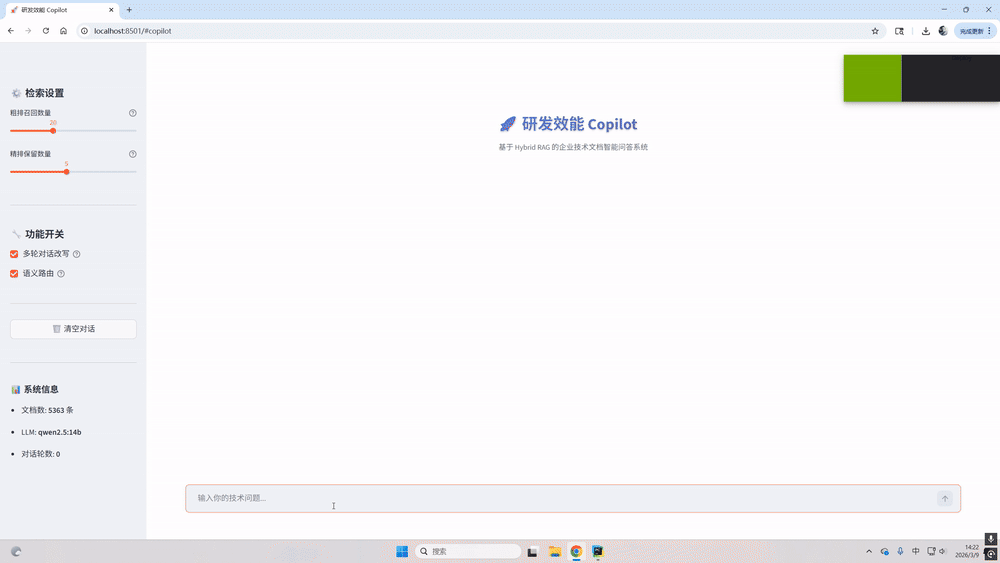
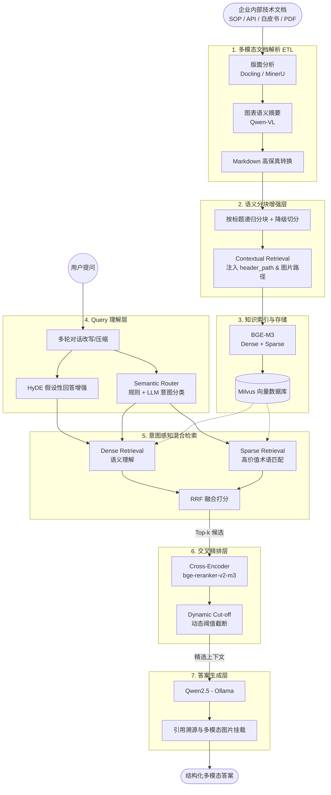

# 🚀 企业级研发效能 Copilot (Multimodal Hybrid RAG)


> 一个面向企业技术文档的 **多模态 Hybrid RAG 知识问答系统**。  
> 深度支持 **版面解析、多模态知识抽取、意图感知混合检索、精排、动态阈值截断与多轮对话**，彻底解决复杂排版和专业术语带来的检索失真问题。



---

## 📑 目录

- [项目背景与痛点](#-项目背景与痛点)
- [系统整体架构](#-系统整体架构)
- [核心技术创新](#-核心技术创新)
- [评测与指标](#-评测与指标)
- [技术栈选型](#-技术栈选型)
- [项目结构](#-项目结构)
- [未来优化方向](#-未来优化方向)

---

## 🎯 项目背景与痛点

企业内部存在大量高价值的技术文档（如：SOP 操作手册、API 文档、技术白皮书、架构设计文档、故障排查手册）。在传统的 RAG 架构下，这些文档的处理往往面临以下三大痛点：

1. **文档解析失真**：普通 PDF 解析仅提取纯文本，导致表格结构丢失、标题层级混乱，系统架构图、流程图等视觉信息完全缺失。
2. **单路检索不稳定**：纯向量（Dense）检索擅长语义泛化，但对专有名词、API 参数等 Exact Match（精确匹配）场景能力极弱。
3. **生成阶段“幻觉”**：召回阶段如果上下文不准或缺失层级关联，LLM 极易产生答非所问的幻觉。

本项目旨在通过**多模态增强**与**混合检索**，在技术文档场景下显著提升检索与回答质量。

---

## 🏗️ 系统整体架构

系统采用多阶段的数据流转与增强策略，从文档解析到最终答案生成的全生命周期链路如下：



---

## 💡 核心技术创新

### 1. Layout-aware 多模态文档解析
摒弃传统纯文本提取，接入 **Docling** 进行深度版面分析：
* 准确识别并保留**标题层级**与**表格结构**。
* 结合 **Qwen-VL** 视觉大模型对架构图、流程图生成高维语义描述，实现“看图检索”，并将图片路径与摘要融合入 Markdown。

### 2. Contextual Retrieval 上下文增强分块
切分 Chunk 时自动注入完整的标题路径（Header Path）与图片引用，解决局部文本指代不明的问题，并提供段落过长时的智能降级切分策略：
```text
# ❌ 普通分块：无法得知参数归属
该参数默认值为 500

# ✅ 增强分块：精准定位参数上下文
[Kafka Guide > Consumer Config > max.poll.records]
该参数默认值为 500
```

### 3. Query 理解与 HyDE 增强
* **多轮 Query 改写**：识别代词与省略主语，将依赖上下文的追问改写为独立的检索 Query。
* **HyDE 增强**：让 LLM 生成假设性答案并拼接至原问题，极大丰富 Dense 向量的语义特征，提升召回率。
* **Semantic Router (95.2% 准确率)**：基于规则+LLM双路分类，将问题路由为 **事实查询 (Factual)**、**原理解释 (Conceptual)** 或 **故障排查 (Troubleshoot)**，并动态调整后续检索策略和 Prompt。

### 4. 意图感知的混合检索与 RRF 融合
动态调整双路检索策略：
* **Factual**：Dense + Sparse（针对 `max.poll.records` 等带点号参数名或大写专有名词进行高价值术语抽取）。
* **Conceptual**：纯 Dense，扩大候选池，交给 Reranker 挑最优。
* **Troubleshoot**：Dense 和 Sparse 均扩大召回池。
采用 **Reciprocal Rank Fusion (RRF)** 算法消除双路分数尺度差异。

### 5. Cross-Encoder 精排与动态截断
* 使用 `bge-reranker-v2-m3` 计算 Query-Doc 的细粒度交互相关性分数。
* **Dynamic Cut-off (动态阈值截断)**：通过绝对分数底线（如 0.15）和断崖式下跌落差（如 0.2）双重校验，剔除噪声文档，节省 Token 并大幅降低大模型幻觉。

---

## 📊 评测与指标

项目构建了专属的 QA 评测数据集，基于真实代码与数据集的消融实验结果如下：

### 检索性能评估 (Hit Rate & MRR)
引入混合检索与精排后，系统的各项检索核心指标均获得断崖式提升：

| 实验阶段 | 核心策略 | Hit Rate@1 | Hit Rate@3 | MRR |
| :--- | :--- | :--- | :--- | :--- |
| **Baseline** | 仅 Dense 单路向量检索 | 52.38% | 85.71% | 0.6508 |
| **+ Hybrid** | Dense + Sparse (RRF 融合) | 57.14% | 90.48% | 0.7063 |
| **🌟 完整系统** | Hybrid + Cross-Encoder Rerank | **71.43%** | **95.24%** | **0.8254** |

### 语义路由评估
Semantic Router 模块在区分 `Factual` (事实查询), `Conceptual` (原理解释), `Troubleshoot` (故障排查) 三种企业常见查询意图上表现优异：
* **整体路由准确率 (Accuracy)**: **95.24%** (测试集仅 1 例错判)

---

## 🛠️ 技术栈选型

| 模块 | 核心技术选型 | 说明 |
| :--- | :--- | :--- |
| **文档解析** | Docling | 高精度版面还原与结构化提取 |
| **VLM (视觉大模型)** | Qwen-VL (32B) | 图表语义理解与摘要生成 |
| **Embedding** | BGE-M3 | 支持多语言，同时输出 Dense 与 Sparse 向量 |
| **向量数据库** | Milvus | 支持混合索引存储的高性能向量库 |
| **Reranker** | bge-reranker-v2-m3 | Cross-Encoder 架构，提升 Top-K 准确率 |
| **LLM / 路由** | Qwen2.5 (14B) | 强大的开源推理、指令遵循与 Query 分析能力 |

---

## 📁 项目结构

```text
Copilot_hybrid_RAG/
├── configs/
│   └── config.yaml             # 全局配置文件
├── data/
│   ├── raw_docs/               # 原始企业文档 (PDF/Word)
│   ├── parsed_docs/            # 解析后的 Markdown/结构化数据
│   ├── images/                 # 多模态解析提取的图片资源
│   └── chunks/                 # 序列化后的分块数据
├── src/
│   ├── doc_parser.py           # 多模态解析器 (Docling + Qwen-VL)
│   ├── chunker.py              # 语义增强分块器 (Header Path + 降级切分)
│   ├── indexer.py              # 向量库构建 (Milvus Dense+Sparse 索引)
│   ├── retriever.py            # 混合检索模块 (高价值术语抽取 + 意图感知)
│   ├── reranker.py             # Cross-Encoder 精排模块
│   ├── router.py               # 语义路由器 (规则+LLM双引擎)
│   ├── memory.py               # 多轮对话上下文管理与改写
│   ├── generator.py            # LLM 答案生成与多模态引用溯源
│   └── pipeline.py             # RAG 全链路串联 (含 HyDE 与 Dynamic Cut-off)
├── frontend/
│   └── app.py                  # Streamlit 交互前端 (规划中)
├── evaluation/
│   ├── eval_dataset.json       # 评测数据集
│   └── evaluate.py             # 评测脚本
└── docker-compose.yaml         # Milvus & 服务一键部署
```

---

## 🚀 未来优化方向

* [ ] **GraphRAG 引入**：构建文档级别的知识图谱，提升复杂逻辑推理的准确率。
* [ ] **Retrieval Cache**：引入语义缓存层，降低高频相似问题的检索延迟与 API 成本。
* [ ] **用户反馈飞轮**：收集前端点赞/踩数据，通过 DPO 持续微调检索策略。
* [ ] **在线评测看板**：集成 Ragas 或 TruLens，实现生成质量的自动化监控。