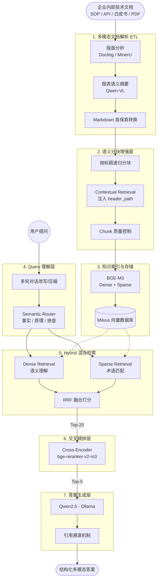

# 🚀 企业级研发效能 Copilot (Multimodal Hybrid RAG)


> 一个面向企业技术文档的 **多模态 Hybrid RAG 知识问答系统**。  
> 深度支持 **版面解析、多模态知识抽取、混合检索、精排、语义路由与多轮对话**，彻底解决复杂排版和专业术语带来的检索失真问题。

---

## 📑 目录

- [项目背景与痛点](#-项目背景与痛点)
- [系统整体架构](#-系统整体架构)
- [核心技术创新](#-核心技术创新)
- [技术栈选型](#-技术栈选型)
- [评测与指标](#-评测与指标)
- [项目结构](#-项目结构)
- [未来优化方向](#-未来优化方向)

---

## 🎯 项目背景与痛点

企业内部存在大量高价值的技术文档（如：SOP 操作手册、API 文档、技术白皮书、架构设计文档、故障排查手册）。在传统的 RAG 架构下，这些文档的处理往往面临以下三大痛点：

1. **文档解析失真**：普通 PDF 解析仅提取纯文本，导致表格结构丢失、标题层级混乱、图表信息完全缺失。
2. **单路检索不稳定**：纯向量（Dense）检索擅长语义泛化，但对专有名词、API 参数等 Exact Match（精确匹配）场景能力极弱。
3. **生成阶段“幻觉”**：召回阶段如果上下文不准或缺失层级关联，LLM 极易产生答非所问的幻觉。

本项目旨在通过**多模态增强**与**混合检索**，在技术文档场景下显著提升检索与回答质量。

---

## 🏗️ 系统整体架构

系统采用多阶段的数据流转与增强策略，从文档解析到最终答案生成的全生命周期链路如下：


---

## 💡 核心技术创新

### 1. Layout-aware 多模态文档解析
摒弃传统纯文本提取，接入 **Docling** 与 **MinerU** 进行深度版面分析：
* 准确识别并保留**标题层级**与**表格结构**。
* 结合 **Qwen-VL** 对架构图、流程图生成高维语义描述，实现“看图检索”。

### 2. Contextual Retrieval (上下文增强分块)
切分 Chunk 时自动注入完整的标题路径（Header Path），解决局部文本指代不明的问题：
```text
# ❌ 普通分块：无法得知参数归属
该参数默认值为 500

# ✅ 增强分块：精准定位参数上下文
[Kafka Guide > Consumer Config > max.poll.records]
该参数默认值为 500
```

### 3. Dense + Sparse 混合检索与 RRF 融合
针对企业文档中密集的专有名词，采用双路检索：
* **Dense**：负责语义泛化理解。
* **Sparse**：负责 API、错误码等精确术语匹配。
* **模型**：`BAAI/bge-m3`。

采用 **Reciprocal Rank Fusion (RRF)** 算法消除双路分数尺度差异，公式如下：

score(d) = Σ ( 1 / (k + rank_i(d)) )

*(注：系统默认设置 k = 60，无需繁琐调参即可获得鲁棒效果)*

### 4. Cross-Encoder 细粒度精排
针对双塔 Embedding 无法建模 Query-Doc 细粒度交互的问题，引入 `bge-reranker-v2-m3`：
* 流程：`Top-20 粗排候选 -> Cross Encoder -> Top-5 精确上下文`。

### 5. Semantic Router 与引用溯源
* **智能路由**：根据问题意图（事实查询 / 原理解释 / 故障排查）自动切换 Prompt 模板。
* **溯源机制**：生成答案时强制附带“文档来源、章节路径、图表出处”，保障企业级应用的可信度。

---

## 🛠️ 技术栈选型

| 模块 | 核心技术选型 | 说明 |
| :--- | :--- | :--- |
| **文档解析** | Docling / MinerU | 高精度版面还原与结构化提取 |
| **VLM (视觉大模型)** | Qwen-VL | 图表语义理解与摘要生成 |
| **Embedding** | BGE-M3 | 支持多语言，同时输出 Dense 与 Sparse 向量 |
| **向量数据库** | Milvus | 支持混合索引存储的高性能向量库 |
| **Reranker** | bge-reranker-v2-m3 | Cross-Encoder 架构，提升 Top-K 准确率 |
| **LLM** | Qwen2.5 (Ollama) | 强大的开源推理与指令遵循能力 |
| **前端交互** | Streamlit | 快速构建轻量级数据交互可视化界面 |
| **部署环境** | Docker Compose | 容器化一键部署环境 |

---

## 📊 评测与指标

项目构建了专属的 QA 评测数据集，并进行了严格的消融实验：

| 实验方法 | 描述 | Hit Rate@5 | Hit Rate@3 | MRR |
| :--- | :--- | :--- | :--- | :--- |
| **Baseline** | 仅 Dense 向量检索 | - | - | - |
| **+ Hybrid** | Dense + Sparse 双路 | 显著提升 | 提升 | 提升 |
| **+ Rerank** | Hybrid + Cross Encoder | 大幅提升 | 大幅提升 | 大幅提升 |
| **🌟 完整系统** | Hybrid + Rerank + Router | **最优** | **最优** | **最优** |

---

## 📁 项目结构

```text
Copilot_hybrid_RAG/
├── configs/
│   └── config.yaml             # 全局配置文件
├── data/
│   ├── raw_docs/               # 原始企业文档 (PDF/Word)
│   ├── parsed_docs/            # 解析后的 Markdown/结构化数据
│   └── chunks/                 # 序列化后的分块数据
├── src/
│   ├── doc_parser.py           # 多模态解析器 (Docling + Qwen-VL)
│   ├── chunker.py              # 语义增强分块器
│   ├── indexer.py              # 向量库索引构建
│   ├── retriever.py            # 混合检索模块 (Dense + Sparse + RRF)
│   ├── reranker.py             # Cross-Encoder 精排模块
│   ├── router.py               # 语义路由器
│   ├── memory.py               # 多轮对话上下文管理
│   ├── generator.py            # LLM 答案生成与溯源
│   └── pipeline.py             # RAG 全链路串联
├── frontend/
│   └── app.py                  # Streamlit 问答交互端
├── evaluation/
│   ├── eval_dataset.json       # 评测数据集
│   └── evaluate.py             # 评测指标计算脚本
└── docker-compose.yaml         # Milvus & 服务一键部署
```

---

## 🚀 未来优化方向

* [ ] **GraphRAG 引入**：构建文档级别的知识图谱，提升复杂逻辑推理的准确率。
* [ ] **Retrieval Cache**：引入语义缓存层，降低高频相似问题的检索延迟与 API 成本。
* [ ] **用户反馈飞轮**：收集前端点赞/踩数据，通过 DPO 持续微调检索策略。
* [ ] **在线评测看板**：集成 Ragas 或 TruLens，实现生成质量的自动化监控。
